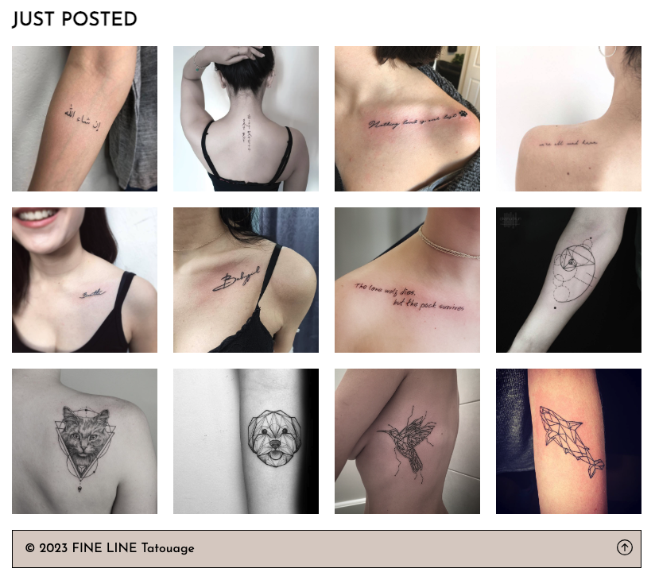
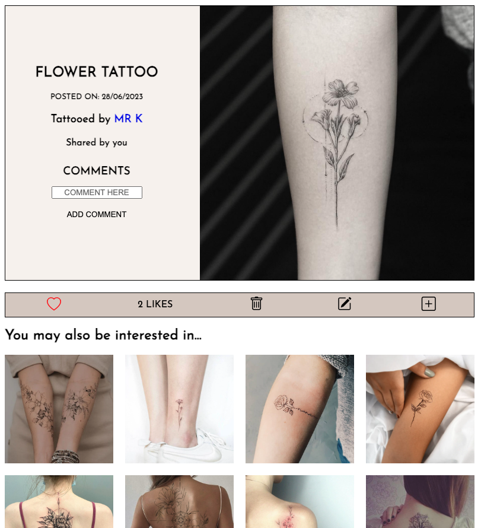
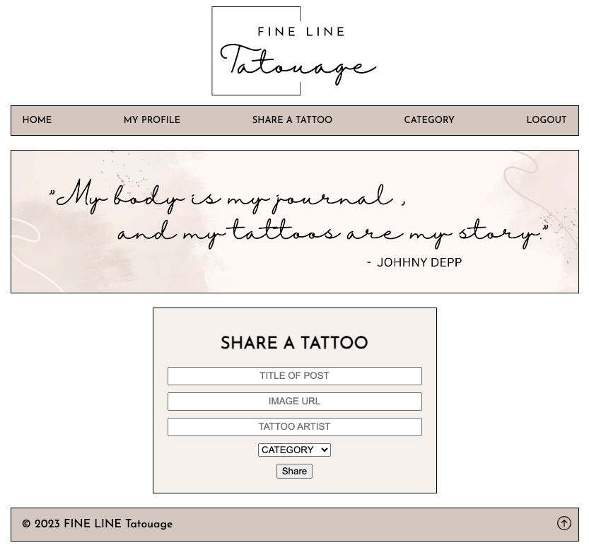

# Fine-Line-Tatouage
### PROJECT 2 - Building a full-stack CRUD application 
As part of General Assembly Software Engineering Immersive course, our second project was to build our first full-stack application using Node/Express/Postgres. 

The requirements was for the app to have full-CRUD data operations and for certain or all routes to be password protected via session authentication. Data is stored in PostgreSQL. 

Check out my Website here - hosted on Render: https://fine-line-tatouage.onrender.com/

To log in, use the test account or create your own account. 

Test account details: 
 
Email: test@test.com
 
Password: testing

### Planning 

I wanted to create a tattoo sharing platform where users can share the tattoos they've got and who the tattoo artist is. I want the app to be a platform where people can come and find inspiration for their own tattoo and to find tattoo artists they trust in creating something that's permanent on their body. 

In terms of the app name, tatouage is tattoo in French, and fine line tattoos are what I'm interested in, hence Fine Line Tatouage. 

Initial wireframe and ERD - 2 more tables to track liked posts and comments were added afterwards. 

### Features 

Without an account or logging in, users will be able to access the home page. The home page will showcase trending tattoos which are tattoos that have received the most likes from users. It will also showcase newly added tattoos. 

Upon clicking on anything on the home page, the user will be redirected to a login page where they will also have to option to sign up. 

Once logged in, if the user clicks on an image, it will bring them to the post showing the following details: 
- Title of the post 
- When it was posted 
- Who the tattoo artist is - clicking on the tattoo artist's name will bring up all the tattoos that the arist created. 
- The user who shared the tattoo - if the user who shared the post is not the user who's logged in, then clicking on the user's name will show all the tattoos they've shared. 

If the post was uploaded by the user who's logged in, the action bar will give the user the option to delete or edit the post. However, if the post does not belong to the user, there will only be the option to like the post or upload a new post. Once the user has liked a post, they cannot increase the number of likes by clicking it again, instead it will unlike that post. 

Within the details, there is also a comment section. Once commented, only the user who posted the comment can delete it. 

At the bottom of the page, similar tattoos will show up for the user to explore. 

The below image shows what the details page looks like when a user clicks on an image that was uploaded by them. 

The below image shows what the details page looks like when a user clicks on another user's image. 

When adding a post, the user will need to fill in the form below. At the moment, the form will only accept an image URL, but an upload picture functionality will be added. 

### Other features 
- When signing up, they system will check if the email and username has already been used, if it is, the page will be redirected to the signup page 
- All tattoos show from newest to oldest except for the trending tattoos section on the home page which shows the posts that have the highest number of likes. 
- Navigation bar becomes a drop-down navigation when on mobile mode 

### Future features
- Function to edit a comment instead of only deleting it 
- Show tattoo artist details when their name is clicked instead of just the tattoos they've done
- Feature to follow certain users or artists  
- Feature to only show a couple of comments and then a see all button to show all comments 

### Technologies used 
- Node.js
- HTML 
- CSS
- JavaScript
- Express.js
- PostgresSQL

### Dependencies used 
- Bcrypt 
- Bootstrap-icons
- Dotenv
- Ejs
- Express 
- Express-ejs-layouts
- Express-session 
- Method-override 
- Cloudinary
- Pg 
