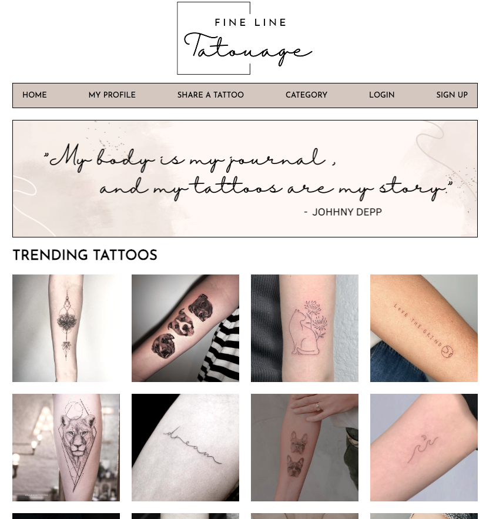

# Fine-Line-Tatouage
### PROJECT 2 - Building a full-stack CRUD application 
As part of General Assembly Software Engineering Immersive course, our second project was to build our first full-stack application using Node/Express/Postgres. 

The requirements was for the app to have full-CRUD data operations and for certain or all routes to be password protected via session authentication. Data is stored in PostgreSQL. 

Check out my Website here - hosted on Render: https://fine-line-tatouage.onrender.com/

To log in, use the test account or create your own account. 

Test account details: 
 
Email: test@test.com
 
Password: testing

 

### Planning 

Tatouage is tattoo in French, and fine line tattoos are what I'm interested in, hence Fine Line Tatouage. 

Initial wireframe and ERD: 

### Features 

Without an account or logging in, users will be able to access the home page. The home page will showcase trending tattoos which are tattoos that have received the most likes from users. It will also showcase newly added tattoos. 

Upon clicking on anything on the home page, the user will be redirected to a login page where they will also have to option to sign up. 

Once logged in, if the user clicks on 

### Future features

### Technologies used 
- Node.js
- HTML 
- CSS
- JavaScript
- Express
- Postgres

### Dependencies used 